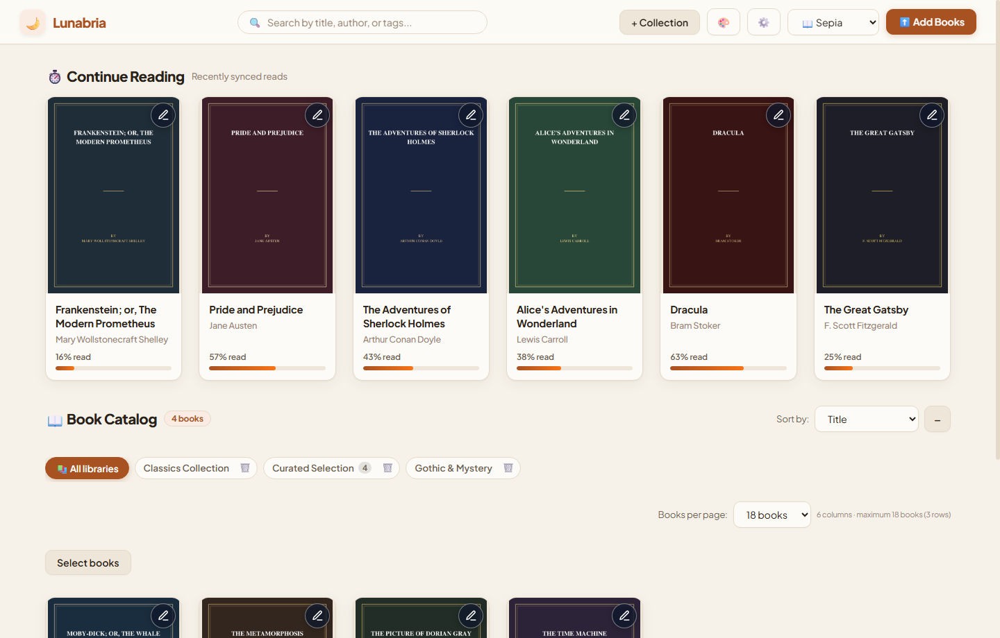
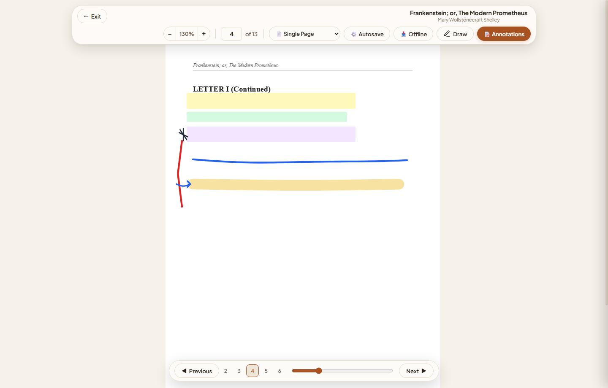
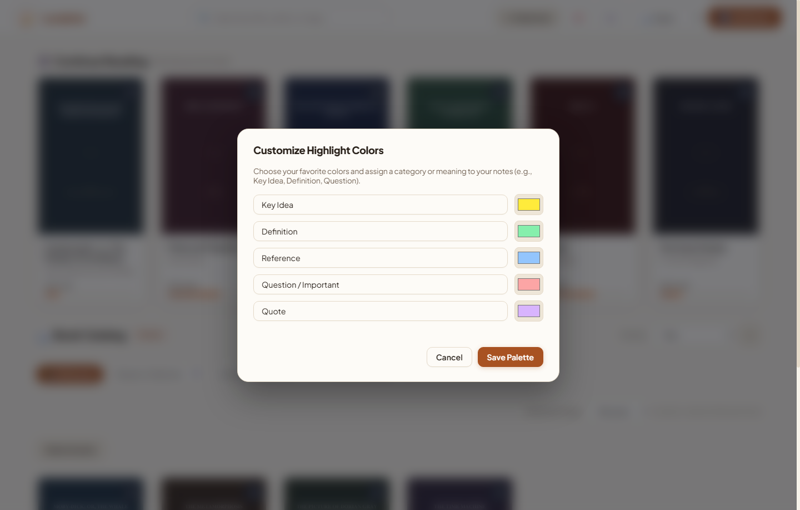
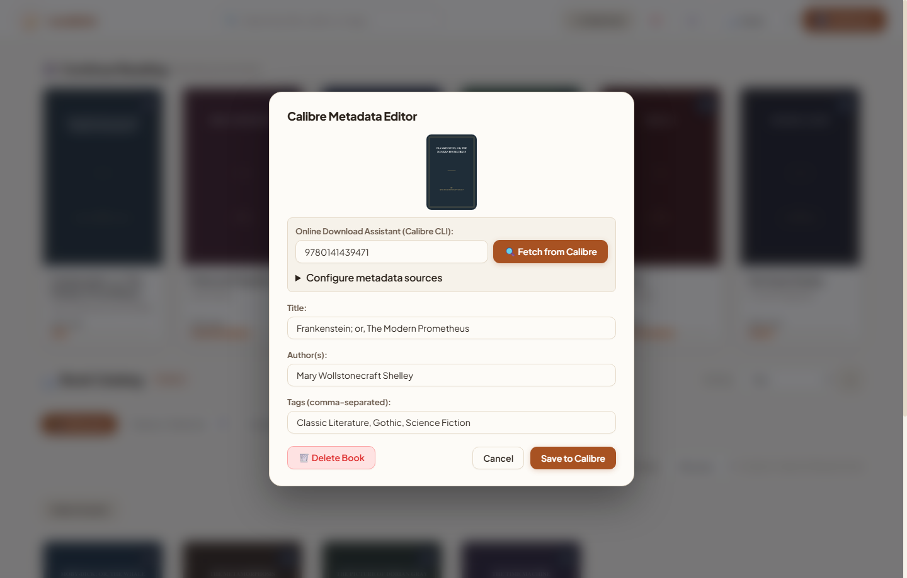
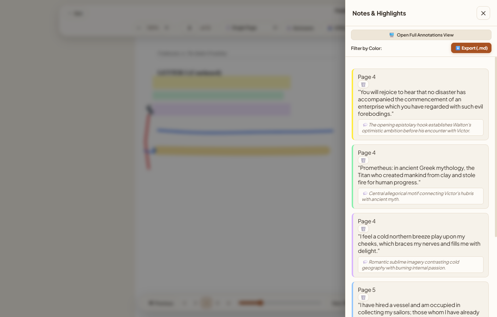
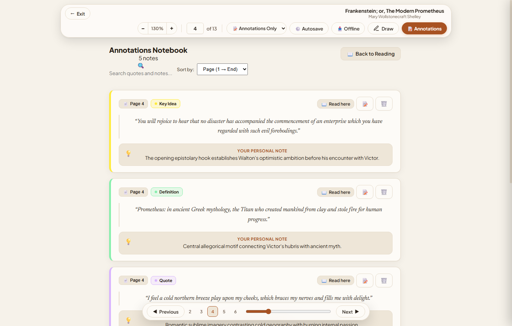
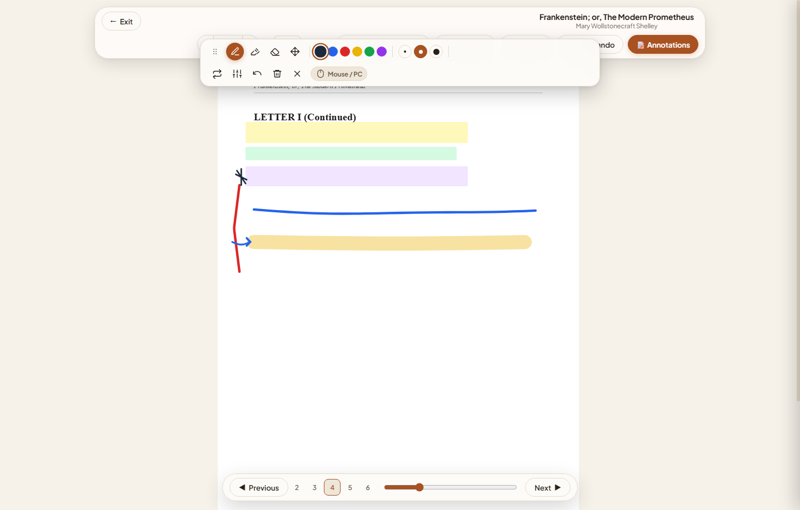
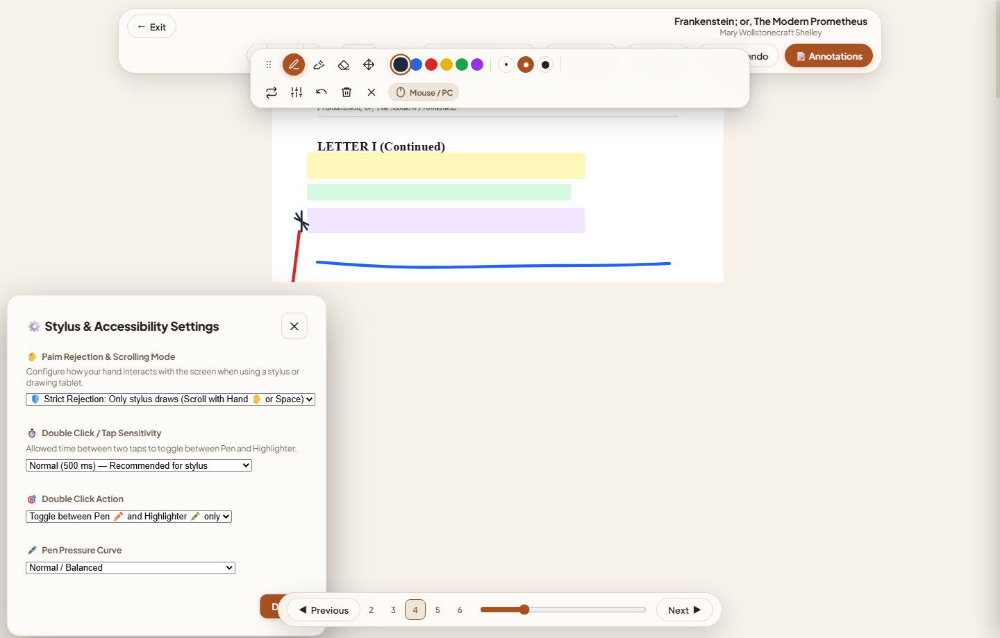

# 🌙 Lunabria (PWA Everywhere)

A modern reading and library management web application connected to Calibre, featuring **HTTP/2** streaming and an ergonomic reading experience inspired by modern e-readers. Accessible from any modern browser and device (desktop, tablet, mobile) as an **offline-capable Progressive Web App (PWA)**.

> [!IMPORTANT]
> **Copyright & Content Policy**: Lunabria is an open-source, self-hosted reading platform and personal library manager. All book titles, covers, and excerpts shown in the screenshots, demo fixtures, and documentation are strictly works in the **public domain** (courtesy of Project Gutenberg and open archives). Lunabria does **not** host, distribute, or bundle copyrighted books. Users must not share or distribute copyrighted materials without appropriate authorization, and are solely responsible for ensuring that all files in their personal Calibre libraries comply with applicable intellectual property laws.

---

## 📸 Screenshots & UI Showcase

### Library Control Center & Continue Reading
Adaptive paginated book grid, collection filters, and live reading progress indicators.



---

### PDF Reader & Real-Time Highlights
Ergonomic reading interface with full text layer selection, page scrubber, and digital stylus support.



---

### Customizable Highlight Palette & Semantic Labels
Personalized color palette with custom semantic categories (*Key Idea*, *Definition*, *Reference*, *Question / Important*, *Quote*).



---

### Calibre Metadata Editor & Online Assistant
In-app metadata editor connected to Calibre CLI with ISBN auto-fetch, tag editor, and cover artwork preview.



---

### Slide-Out Annotations Drawer & Markdown Export
Interactive lateral notes drawer with real-time color filtering and one-click `.md` export for Obsidian / Logseq.



---

### Full-Screen Annotations Notebook
Dedicated editorial study view organizing quotes, personal notes, and chapter reflections.



---

### Freehand Stylus Drawing & Smart Pencil Toolbar
Integrated drawing canvas with pressure sensitivity, customizable pen colors, highlighter mode, and instant sync.



---

### Stylus Hardware & Palm Rejection Settings
Tailored stylus interactions with strict palm rejection, double-tap pen/highlighter toggle, and custom pressure dynamics.



---

## 🌟 Key Features

### 1. Core System Views

1. **Home (Library Control Center):**
   - **"Continue Reading" Carousel:** Displays the **10 most recently read books** with live progress, reading percentage, and current page. One click resumes reading right where you left off.
   - **Adaptive Paginated Catalog:** Dynamic grid view that adapts to your screen width, supporting customizable page sizes and responsive column layouts.
   - **Virtual Library Switcher:** Filter your book collection on the fly without duplicating files on disk.
   - **Batch Book Selection:** Pick multiple books from search results or the catalog to group them into manual virtual collections.
   - **Real-Time Search:** Instant filtering across titles, authors, and tags.
   - **Ergonomic Reading Themes:** **Sepia** (warm editorial daylight), **AMOLED Black** (pure `#000000` for OLED displays), and **Dark** (slate).

2. **Reader Experience:**
   - **Contextual Floating Menu:** Select text to reveal quick action controls: highlight color palette, notes, and clipboard copy.
   - **Customizable Highlight Palette:** Freely configure your own colors and semantic labels (e.g., *Key Idea*, *Definition*, *Question*, *Quote*).
   - **Freehand Stylus & Digital Inking:** Draw notes, margin diagrams, underlines, and freehand highlights directly on book pages with pressure sensitivity, palm rejection, and dedicated stylus hardware settings.
   - **Slide-out Lateral Drawer:** Chronologically lists all highlights, annotations, and notes with interactive color filtering.
   - **Markdown Export:** Export annotations and excerpts directly to **Markdown (`.md`)** ready for Obsidian, Logseq, or notes apps.
   - **Offline Reading (PWA):** Download books and pre-buffer page layouts into client IndexedDB for reading on flights or commutes without network coverage.
   - **On-Demand EPUB Conversion:** If a book is only available in EPUB format, it is automatically converted to PDF when opened and cached without altering the original Calibre library.

3. **Add New Books:**
   - Drag-and-drop or select one or multiple PDF files.
   - **Verification Wizard:** Optional ISBN lookup before importing to automatically retrieve official title, authors, tags, and summary via Calibre, or direct import without metadata scraping.

4. **Calibre Metadata Editor:**
   - Modify title, authors, tags, series, series index, and synopsis.
   - **"Download Metadata" Assistant:** Runs Calibre CLI (`fetch-ebook-metadata`) to scrape summaries and high-resolution book covers.
   - Configure metadata sources (Google Books, Open Library, Amazon, Goodreads).
   - Commits changes directly to Calibre's `metadata.db` via `calibredb set_metadata`.

---

## 📚 Virtual Libraries (2 Creation Modes)

- **Query / Regex Mode:** Define Calibre-native search syntax (e.g., `tags:"=University"` or regular expressions).
- **Manual Mode:** Check off specific books from the catalog or search queries to create curated reading lists.
- **Zero Duplication:** No physical files are moved or duplicated.

---

## 🚀 Development Setup (WSL2 / Linux VM / Local)

The application runs seamlessly on Linux, macOS, or inside a **WSL2** virtual machine equipped with Python 3.11+ and Calibre.

All commands and configurations use paths relative to the repository root:

1. **Set up the virtual environment:**
   ```bash
   cd backend
   python3 -m venv .venv
   source .venv/bin/activate  # On Windows: .venv\Scripts\activate
   pip install -r requirements.txt
   cd ..
   ```

2. **Configure environment variables:**
   ```bash
   cp .env.example .env
   ```

3. **Run the development server:**
   ```bash
   cd backend
   python run.py
   ```

If launching from a Windows host into your dedicated WSL2 distribution:
```bash
wsl -- bash -c "cd backend && python3 run.py"
```

Open your browser at: `http://localhost:8000` (or `https://localhost:8443` for HTTPS with HTTP/2).

---

## 🐧 Server Deployment (Linux / systemd / Caddy)

1. **Install Calibre and system dependencies:**
   ```bash
   sudo apt update
   sudo apt install -y calibre python3-venv python3-pip caddy
   ```

2. **Prepare the project environment:**
   ```bash
   cd backend
   python3 -m venv .venv
   ./.venv/bin/pip install -r requirements.txt
   cd ..
   ```

3. **Configure environment variables:**
   ```bash
   cp .env.example .env
   ```
   Key environment variables:
   ```bash
   CALIBRE_LIBRARY_PATH=./data/calibre_library
   APP_DATA_DIR=./data
   HOST=0.0.0.0
   PORT=8000
   ```

4. **Enable the systemd service:**
   ```bash
   sudo cp systemd/lunabria.service /etc/systemd/system/
   sudo systemctl daemon-reload
   sudo systemctl enable --now lunabria
   ```

5. **Start Caddy Reverse Proxy (with HTTP/2 support):**
   ```bash
   sudo cp caddy/Caddyfile /etc/caddy/Caddyfile
   sudo systemctl restart caddy
   ```

Once running, access the application locally at `http://localhost:8000` or through Caddy at `https://localhost:8443` (or `http://<SERVER-IP>:8080`).

---

## 📄 License

This project is licensed under the **GNU Affero General Public License v3.0 (GNU AGPL v3)**. See the [LICENSE](LICENSE) file for the full license text.
