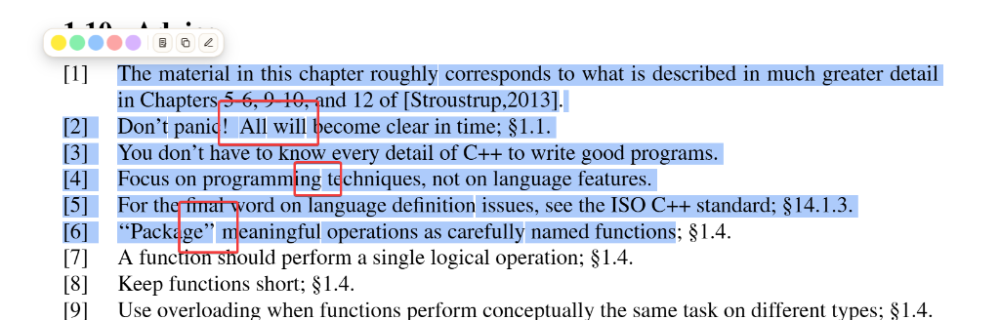
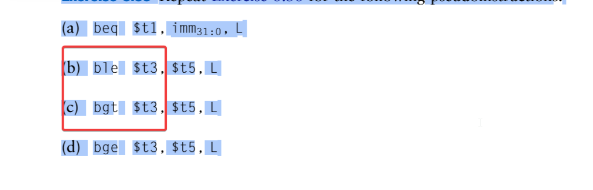

# 🔍 Known Issues & Typography Limitations (Casos Borde y Limitaciones Conocidas)

Este documento recopila limitaciones técnicas inherentes a la extracción tipográfica de documentos PDF, fuentes no catalogadas, libros escaneados y discrepancias temporales de layout en el visor de Lunabria.

---

## 📑 Índice de Casos y Limitaciones

1. [Falta de Capa de Texto (Libros Escaneados o Basados en Imágenes sin OCR)](#1-falta-de-capa-de-texto-libros-escaneados-o-basados-en-imágenes-sin-ocr)
2. [Geometrías Complejas, Kerning Asimétrico y Glifos Problemáticos](#2-geometrías-complejas-kerning-asimétrico-y-glifos-problemáticos)
3. [Tipografías Monospaciadas, Bloques de Código y Subíndices/Superíndices](#3-tipografías-monospaciadas-bloques-de-código-y-subíndicessuperíndices)
4. [Espacios en Blanco Finales y Saltos de Bloque en Formatos Específicos](#4-espacios-en-blanco-finales-y-saltos-de-bloque-en-formatos-específicos)
5. [Carga Cruzada / Desfase Temporal del Layout entre Documentos](#5-carga-cruzada--desfase-temporal-del-layout-entre-documentos)

---

### 1. Falta de Capa de Texto (Libros Escaneados o Basados en Imágenes sin OCR)
* **Descripción:** Algunos libros (principalmente digitalizaciones antiguas, facsímiles o PDFs que consisten exclusivamente en imágenes JPG/TIFF compiladas) carecen por completo de una capa de texto vectorial subyacente (`text stream`).
* **Comportamiento en Lunabria:**
  * El visor renderiza la página visualmente con fidelidad mediante Canvas.
  * No es posible seleccionar texto con el cursor ni aplicar resaltados semánticos basados en texto ([`TextLayerView`](../frontend/js/views/reader/TextLayerView.js)), ya que el motor PyMuPDF/PDF.js no detecta cadenas ni caracteres.
* **Workaround / Solución:**
  * Se puede utilizar el **modo stylus / dibujo libre** para anotar a mano o subrayar con el resaltador gráfico sobre el canvas.
  * Para habilitar selección y búsqueda de texto nativa, se recomienda procesar el documento con herramientas OCR como `OCRmyPDF` antes de importarlo a Calibre.

---

### 2. Geometrías Complejas, Kerning Asimétrico y Glifos Problemáticos
* **Descripción:** Determinados libros técnicos o de editoriales académicas emplean fuentes OpenType/Type 1 con ligaduras personalizadas (`fi`, `fl`, `ff`), pares de kerning agresivos o signos de puntuación pegados a comillas (p. ej., `“Package”`, `! All`, `ing te`).

* **Comportamiento en Lunabria:**
  * Al seleccionar texto, pueden apreciarse micro-separaciones o pequeños saltos entre el signo de puntuación y la palabra adyacente (rectángulos delimitadores independientes dentro de `.precise-word`).
  * En fragmentos como `! All` o `“Package”`, el delimitador puede generar un salto en la caja de selección debido a que el motor del PDF emite la comilla o el signo de exclamación en un bloque tipográfico de ancho cero o con matriz de transformación separada.
* **Impacto:** Es una discrepancia puramente cosmética en el overlay de selección (`::selection`); el texto copiado al portapapeles o guardado en anotaciones mantiene los caracteres correctos.

---

### 3. Tipografías Monospaciadas, Bloques de Código y Subíndices/Superíndices
* **Descripción:** En fragmentos con instrucciones en ensamblador o código (ej. MIPS, C++, Python) y expresiones con subíndices matemáticos (como `$t1, imm_{31:0}, L`):

* **Comportamiento en Lunabria:**
  * Los subíndices y caracteres de control suelen tener una línea base vertical ($y_0$) desplazada varios puntos respecto al texto principal.
  * La separación de palabras de PyMuPDF puede interpretar el subíndice como una micro-palabra aislada, generando cajas de selección segmentadas por palabra en lugar de una franja homogénea.
* **Impacto:** La selección visual aparece fragmentada en bloques rectangulares individuales por token; sin embargo, el texto se extrae y exporta fielmente a Markdown.

---

### 4. Espacios en Blanco Finales y Saltos de Bloque en Formatos Específicos
* **Descripción:** En listings de código con declaraciones extensas (ej. endpoints HTTP largos como `GET /v1/health/service/{service_name}?passing=true`):

* **Comportamiento en Lunabria:**
  * Si el PDF define un espacio o delimitador al final de la línea que sobrepasa el último carácter visible, puede aparecer un pequeño remanente o cursor vertical al borde derecho de la caja.
* **Impacto:** Representa el delimitador de salto de línea / espacio conservado para evitar que al copiar el código se fusionen líneas consecutivas sin espacio.

---

### 5. Carga Cruzada / Desfase Temporal del Layout entre Documentos
* **Descripción:** En ocasiones excepcionales, al cambiar rápidamente de libro en el visor sin recargar la pestaña del navegador, el visor puede retener en caché o dibujar el layout tipográfico (coordenadas de palabras) del documento anterior sobre las páginas del nuevo documento.
* **Causa:** Las peticiones asíncronas de layout de página (`/api/books/{id}/pages/{page}/layout`) resuelven con ligeras diferencias de tiempo respecto a la renderización del canvas de PDF.js cuando hay navegación concurrente rápida.
* **Solución Rápida (Workaround):**
  * **Hacer un zoom in o zoom out** (con la rueda del ratón, `Ctrl + Scroll` o los botones de zoom en el HUD): esto invalida inmediatamente el árbol DOM del `TextLayerView`, cancela las tareas de renderizado previas y fuerza un recalculo limpio de geometrías de la página actual.
  * También se puede alternar entre la vista paginada y la vista de flujo continuo.
